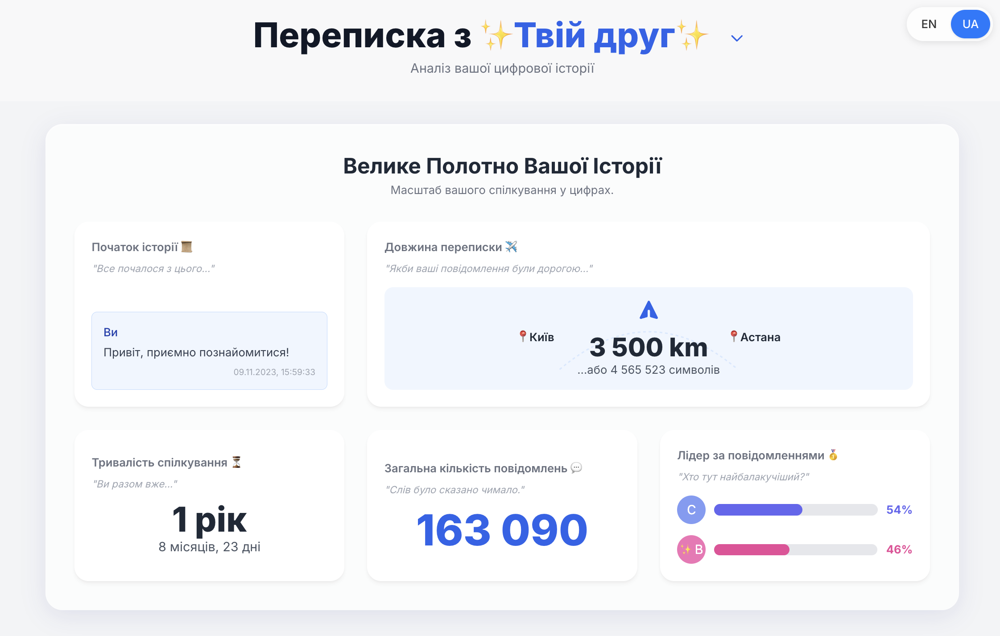
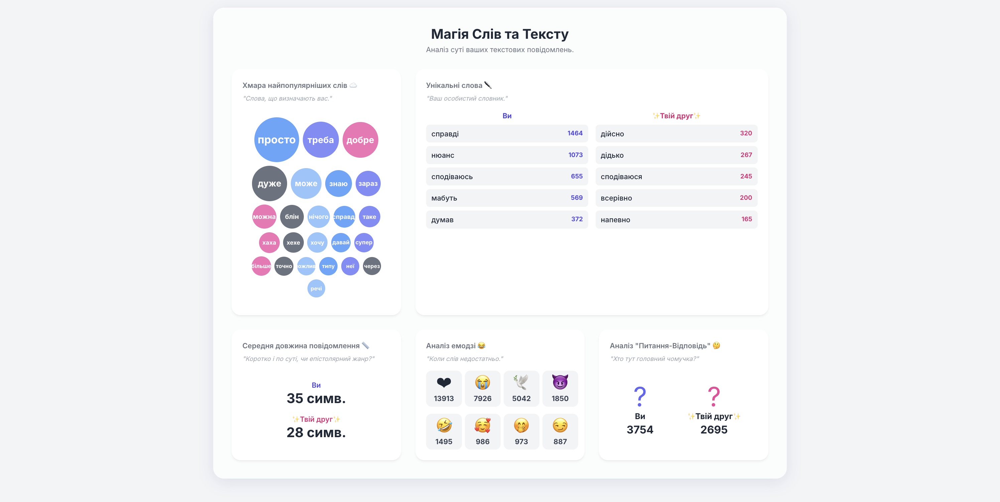
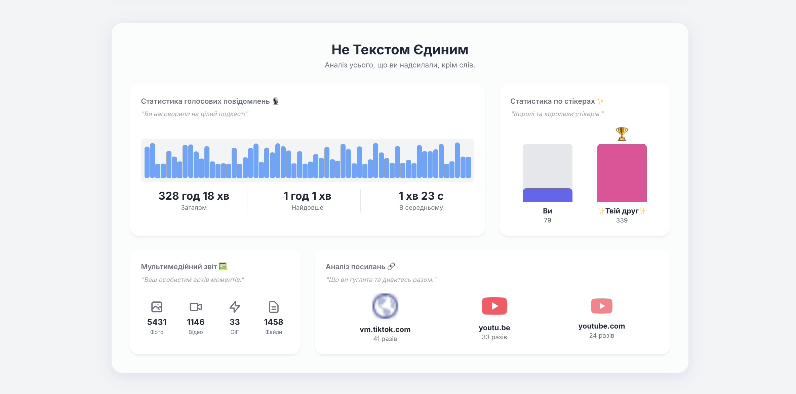
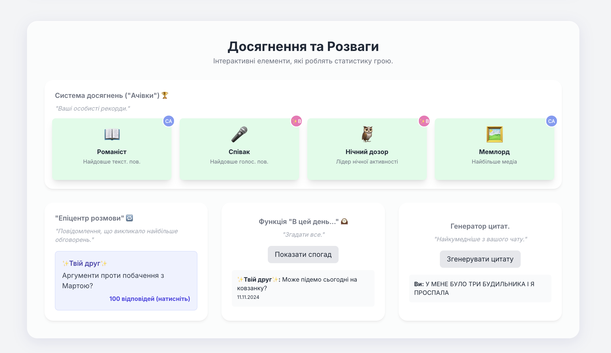
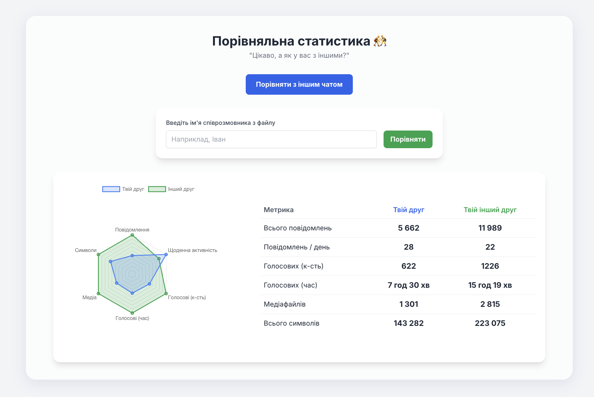

  

  
  

  
  

---

# Telemetria - Статистика чату Telegram

Telemetria - це інтерактивний візуалізатор для експорту ваших чатів Telegram, який працює повністю у вашому браузері задля **100% приватності**. Просто завантажте вашу експортовану папку, щоб перетворити історію особистих чатів на інформативну панель.

## ✨ Основні можливості

### 1. Велика картина та Лідерство

Дізнайтеся тривалість вашого чату, загальну кількість повідомлень та навіть хто лідирує в розмові з детальними відсотковими розбивками.

  

### 2. Глибокий аналіз тексту

Зануртеся глибоко в аналіз тексту з динамічною хмарою слів, детальною статистикою емодзі, середньою довжиною повідомлення та відстеженням унікального словникового запасу.

  

### 3. Мультимедійний звіт

Перегляньте повний звіт про ваші медіа, включно із загальною тривалістю голосових повідомлень, використанням стікерів, найпопулярнішими посиланнями, фото та відео.

  

### 4. Ритм спілкування

Досліджуйте ритм вашого спілкування за допомогою інтерактивної часової шкали, теплових карт годинної активності та середнього часу відповіді між користувачами.

  

### 5. Розваги та Досягнення

Відкрийте для себе цікаві інсайти за допомогою вбудованої системи досягнень, функції "епіцентру" для пошуку найбільш обговорюваних повідомлень та генератора ностальгії "в цей день".

  

### 6. Порівняння чатів

Спробуйте потужний інструмент для порівняння вашої статистики (повідомлень, медіа, часу голосових) з будь-яким іншим особистим чатом, доступним у вашому файлі експорту.

  

---

## 🚀 Початок роботи

## ⬇️ Інструкції з Експорту

### 1. Експортуйте ваші дані з Telegram

(Якщо ви користуєтеся Mac, то вам потрібно буде завантажити Telegram Lite.)

* Відкрийте Telegram та перейдіть до: `Налаштування > Розширенні > Експорт даних Telegram`.
* У налаштуваннях експорту переконайтеся, що обрали **Особисті чати**. Ви можете зняти прапорці з усіх інших типів, як-от групи чи канали.
* У розділі "Налаштування медіа" оберіть лише **Голосові повідомлення**.
* Внизу змініть формат з "HTML" на **"JSON"**.
* Натисніть **Експорт** і дочекайтеся завершення процесу. Зазвичай процес досить повільний, тому наберіться терпіння. Telegram збереже папку з вашими даними в папку `Telegram Desktop`.

    

### 2. Отримайте вашу статистику

* Завантажте єдиний файл `Telegram.Stats.html` з цієї сторінки **[Релізи](https://github.com/Shenshyn/telemetria-telegram-stats/releases)** репозиторію.
* Відкрийте завантажений файл `Telegram.Stats.html` у своєму браузері.
* Натисніть кнопку "Вибрати папку з історією".
* Оберіть **всю папку** (а не окремий файл), яку Telegram щойно експортував.
* Ваш браузер покаже спливаюче вікно з проханням надати дозвіл на читання файлів. Натисніть "Завантажити" або "Дозволити".
* Це все! Оберіть чат, який ви хочете проаналізувати, зі списку та насолоджуйтесь статистикою.

***

### 🔒 Приватність

Цей інструмент є **100% приватним**. Вся обробка даних відбувається **локально у вашому браузері**. Файли ваших чатів **ніколи не завантажуються на жоден сервер**.
