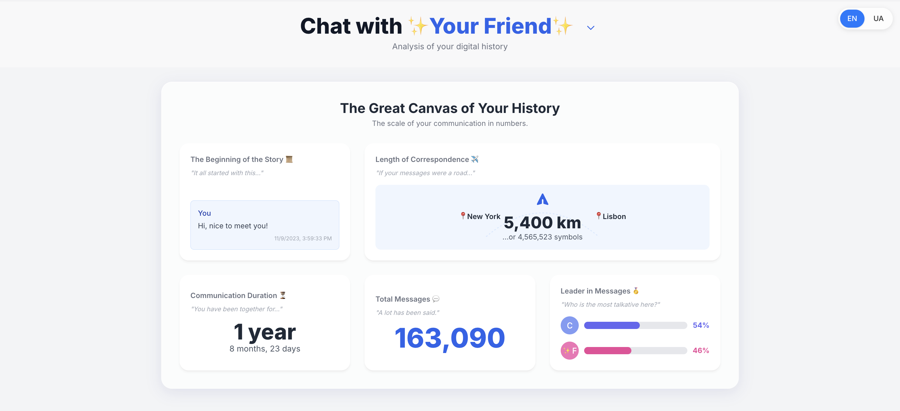
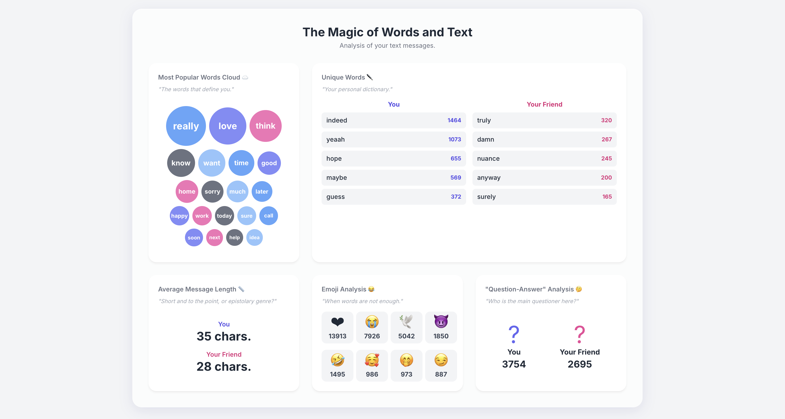
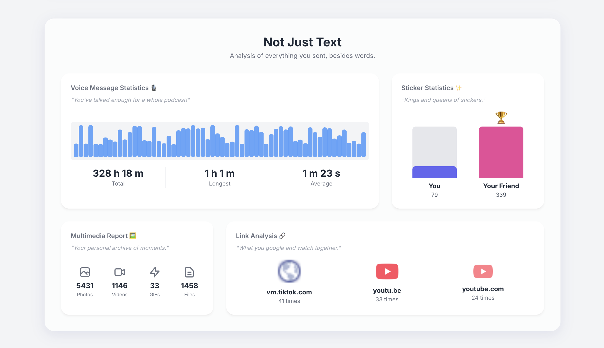
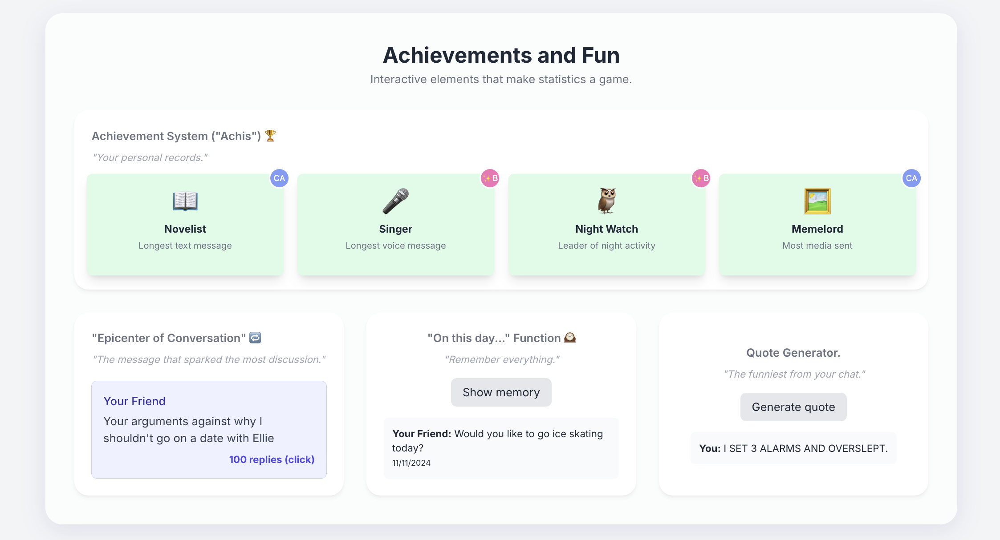
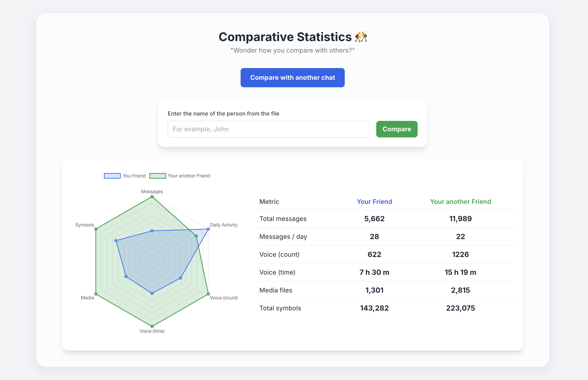

  

  
  

  
  

---

# Telemetria - Telegram Chat Statistics

Telemetria is an interactive visualizer for your Telegram chat exports that runs entirely in your browser for **100% privacy**. Just upload your exported folder to transform your personal chat history into an insightful dashboard.

## ✨ Core Features

### 1. The Big Picture & Leadership

Discover your chat duration, total message counts, and even who leads the conversation with detailed percentage breakdowns.

  

### 2. Deep Text Analysis

Dive deep into text analysis with a dynamic word cloud, detailed emoji statistics, average message length, and unique vocabulary tracking.

  

### 3. Multimedia Breakdown

See a full breakdown of your media, including total voice message duration, sticker usage, top shared links, photos, and videos.

  

### 4. Communication Rhythm

Explore the rhythm of your communication with an interactive timeline, hourly activity heatmaps, and average reply times between users.

  

### 5. Fun & Achievements

Unlock fun insights with a built-in achievement system, an 'epicenter' feature to find the most-discussed messages, and a nostalgia 'on this day' generator.

  

### 6. Chat Comparison

Try out a powerful tool for comparing your statistics (messages, media, voice time) against any other personal chat available in your export file.

  

---

## 🚀 Getting Started

## ⬇️ Export Instructions

### 1. Export Your Data from Telegram

(If you are on a Mac, you need to download Telegram Lite.)

* Open Telegram and go to: `Settings > Advanced > Export Telegram Data`.
* In the export settings, make sure to check **Personal Chats**. You can uncheck all other types like groups or channels.
* In the “Media export settings” section, select only **Voice Messages**.
* At the bottom, change the format from "HTML" to **"JSON"**.
* Click **Export** and wait for the process to finish. The process is usually quite slow, so you need to be patient. Telegram will save the folder with your data in the `Telegram Desktop` folder.

    

### 2. Get Your Stats

* Download the single `index.html` file from this repository's **[Releases](https://github.com/Shenshyn/telemetria-telegram-stats/releases)** page.
* Open the downloaded `index.html` file in your browser.
* Click the "Select history folder" button.
* Select the **entire folder** (not a single file) that Telegram just exported.
* Your browser will show a pop-up asking for permission to read the files. Click "Upload" or "Allow".
* That's it! Select the chat you want to analyze from the list and enjoy your stats.

***

### 🔒 Privacy Notice

This tool is **100% private**. All data processing is performed **locally in your browser**. Your chat files are **never uploaded to any server**.
